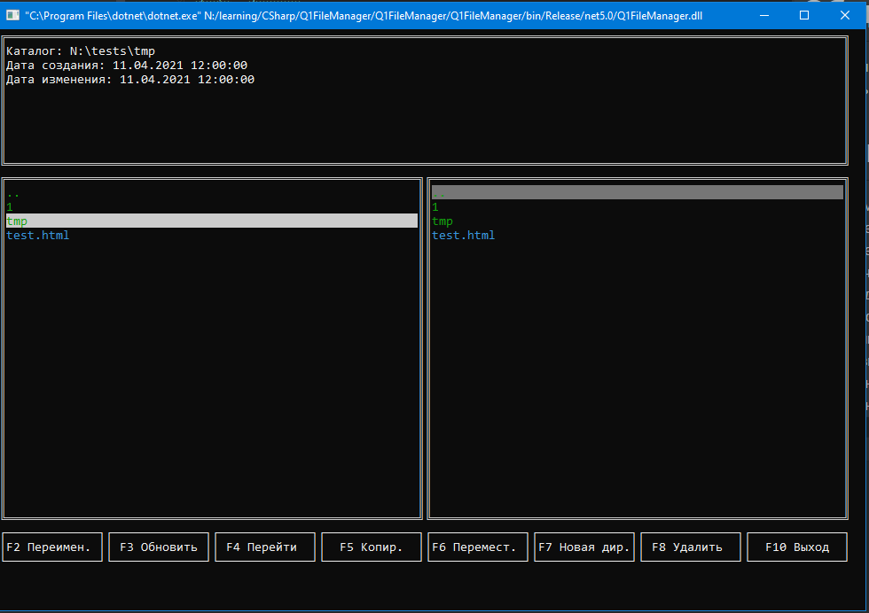

# Общие сведения
Требуется создать консольный файловый менеджер начального уровня, который покрывает минимальный набор функционала по работе с файлами.
# Функции и требования
1. Просмотр файловой структуры
1. Поддержка копирование файлов, каталогов
1. Поддержка удаление файлов, каталогов
1. Получение информации о размерах, системных атрибутов файла, каталога
1. Вывод файловой структуры должен быть постраничным
1. В конфигурационном файле должна быть настройка вывода количества элементов на страницу
1. При выходе должно сохраняться, последнее состояние
1. Должны быть комментарии в коде
1. Должна быть документация к проекту в формате md
1. Приложение должно обрабатывать непредвиденные ситуации (не падать)
1. При успешном выполнение предыдущих пунктов – реализовать сохранение ошибки в текстовом файле в каталоге errors/random_name_exception.txt
1. При успешном выполнение предыдущих пунктов – реализовать движение по истории команд (стрелочки вверх, вниз)

Команды должны быть консольного типа, как, например, консоль в Unix или Windows. Соответственно требуется создать парсер команд, который по минимуму использует стандартные методы по строкам.

# Реализация
Скриншот: 

Менеджер состоит из 5 областей:
1. Информационная панель - на ней выводится данные о текущем файле/папке и информационные сообщения для пользователя
1. Левая и правая панель файлов - в них реализовано отображение файлов, также они участвуют в операциях с файлами
1. Панель кнопок - подсказка по основным кнопкам
1. Панель пользовательских команд - заполняется если нужна дополнительная информация или поддтверждение от пользователя.

Помимо указанных в панели кнопок, есть отслеживание кнопок:
* Стрелка вверх, стрелка вних, Home, End, PageUp, PageDown - для прокрутки файлов в активной панеле
* Tab - для переключения между панелями
* Enter - смена каталога, попытка запуска файла 

Цветовые выделения (цвета прописаны в Q1FileManager.ConsoleView.Color)
* Зеленый - каталоги
* Синий - папки